# __Bus Koi__

## **Project Overview**

Users of the system are the passengers who are willing to avail tickets online and without any
physical presence. This system shall provide a solution for long distant transportation
throughout the country. Through such a project, the purpose was to develop a system that shall
enhance the overall experience of the passengers with comfort and convenience. As in, people
will obtain a more enhanced experience from pre-journey period to the very end of the
journey. Moreover, the system covers some safety measures and precautionary features during
the travel period.

## **Features**

* e-Ticketing 
* Live Tracking
* Schedule Maintenance
* Record Keeping

<!-- <iframe width="520" height="315"
  src="http://www.youtube.com/embed/k4V3Mo61fJM">         img\buskoi\ss\user_app\driver_app
</iframe> -->

## **UML Diagrams**

1. Use Case Diagram
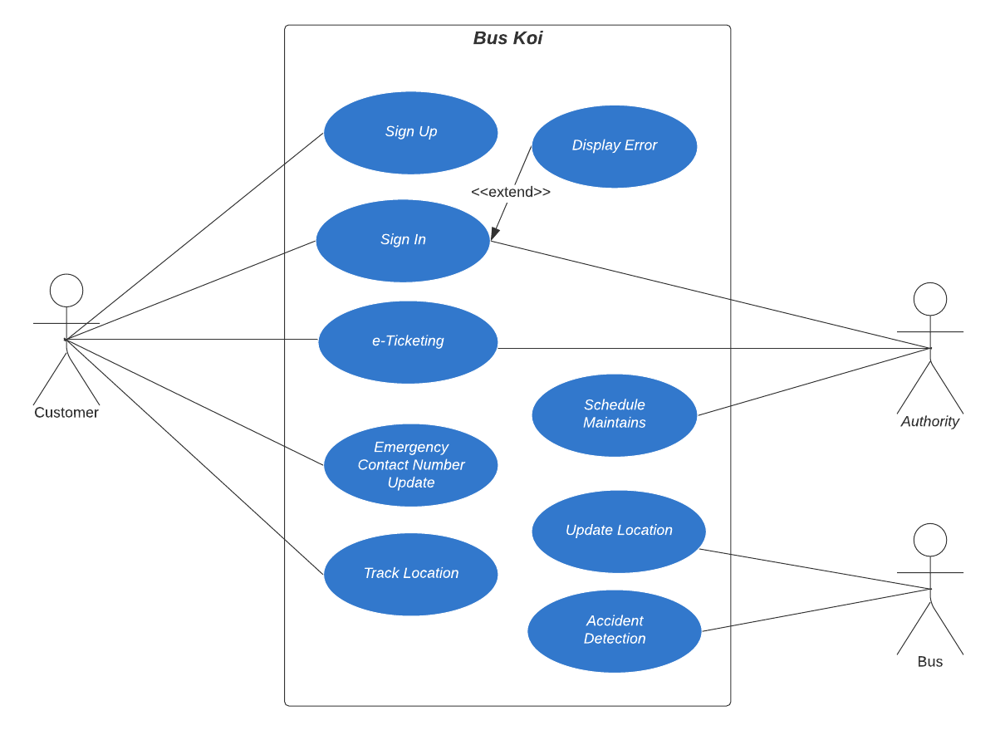{ align=left }    
 
2. Data Flow Diagram
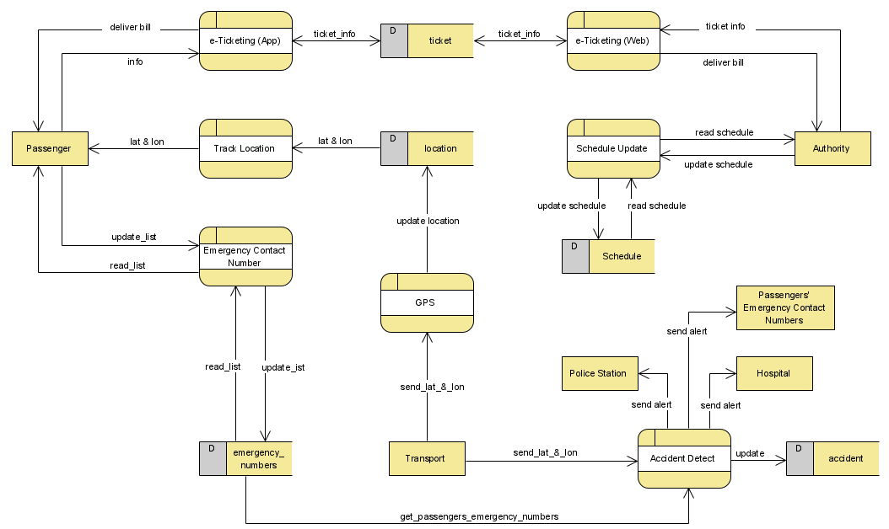
    
    !!! info
        First the customer shall sign-up for the Bus Koi App, providing various information. While doing so, the passenger shall provide Emergency Contact numbers which will be stored in the emergency_numbers database, and can also be updated by the user as passenger himself, moreover the process Emergency_Contact_Number returns the existing contact numbers to the passenger. Here. Via the e-Ticketing App process the user can get the ticket information and can avail ticket.

        Through the e-Ticketing App process, the passenger first give information and based upon those information, the process then extracts relevant information and returns them to the passenger.

        The Authority gets the Ticket purchase information though e-Ticketing web and consequently deliver bill. The Authority can also update the Schedule of the transports through Schedule_Update_process via Schedule_database.

        Via the location_database, and through Track_Location the customer can track the location of his desired transport. The Transport will provide its live location by the GPS, which is stored and updated in the location database.

        Through the Accident Detection process, if any accident occurs to the Transport, the nearest Police Station & Hospital shall be sent Alert Message and consequently update the accident database.

        Via emergency_numbers database, the Accident Detection process can access the emergency numbers; thus allowing to send alert message to the passengers’ close people.

3. Class Diagram

    
    !!! info
        The Passenger Class is connected to the Ticket class which has composition relationship and schedule class as association relationship more the Passenger class has a composition relationship with the Passengers’_Emergency_Contact_Numbers class, while the Authority class is connected to the both Ticket class and Schedule class for the Ticketing system and maintains the corresponding schedule to the transports via Association relationship.
        
        Bus_Passengers’_Emergency_Contact_Numbers has an aggregation relationship with the Accident class.

        The Schedule class has a relationship with Ticket and Accident class, having a Composition relationship with both of them. The Schedule class is also connected to the Accident class as Aggregation relationship and Bus class as Composition relationship. The Accident class has an Aggregation relationship with the Hospital and Police_Station class; While, the Bus class is connected with Schedule and Live_Tracking class through Composition relationship.

!!! warning
    <b>Here I am showing only 2 features of them: </b> 
     <ul>
      <li>e-Ticketing</li>
      <li>Live Tracking</li>
     </ul> 

## **API Tree**
{ align=center } 

## Architecture And Tools Used In App
    * MVVM Architecture
    * Retrofit
    * Material Design
    * Recyclerview
    * Google Maps API

## Video Demo
#### 1. e-Ticketing
  <iframe width="660" height="400"
    src="http://www.youtube.com/embed/cw602-SHNvM">         img\buskoi\ss\user_app\driver_app
  </iframe>

#### 2. Live Tracking
  <iframe width="660" height="400"
    src="http://www.youtube.com/embed/OaSlBvAGUlM">         img\buskoi\ss\user_app\driver_app
  </iframe>

## **Screenshots of <u style="color:#4051B5;">_BusKoi_</u> App (Passenger)**

#### 1. Navigation Drawer
  <figure>
    
    <figcaption> </figcaption>
  </figure>

#### 2. Ticket Purchasing
  

    <figure style="display: inline-block;">
      
      <figcaption> 1</figcaption>
    </figure>

    <figure style="display: inline-block;">
      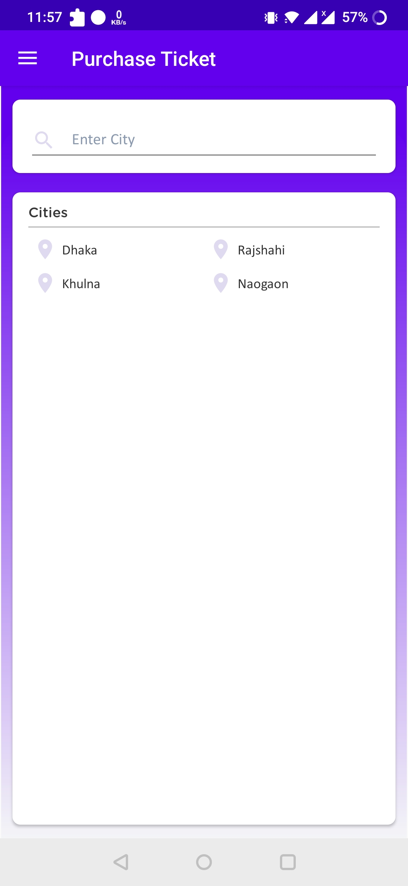
      <figcaption> 2 </figcaption>
    </figure>

    <figure style="display: inline-block;">
      
      <figcaption> 2 </figcaption>
    </figure>

    <figure style="display: inline-block;">
      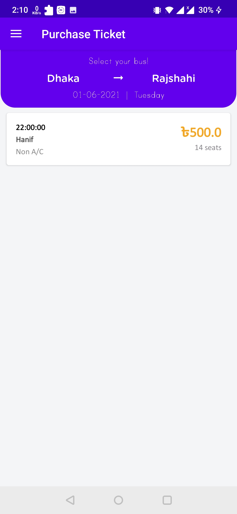
      <figcaption> 3 </figcaption>
    </figure>
    
    <figure style="display: inline-block;">
      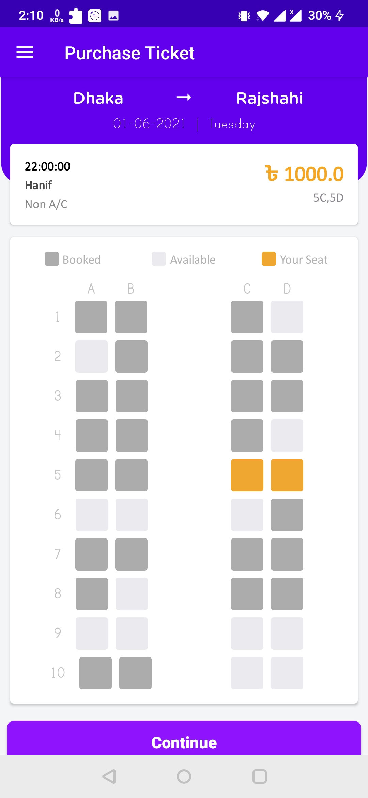
      <figcaption> 4 </figcaption>
    </figure>
    <figure style="display: inline-block;">
      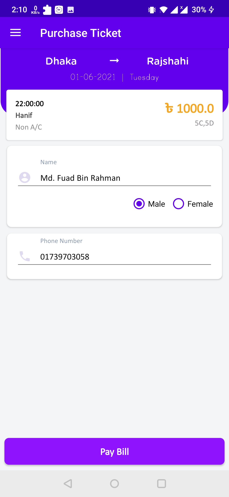
      <figcaption> 5 </figcaption>
    </figure>
    <figure style="display: inline-block;">
      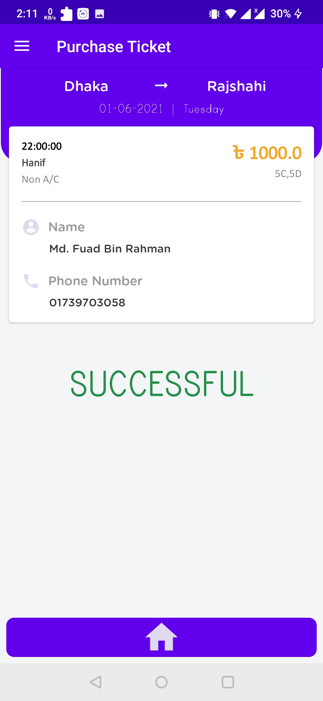
      <figcaption> 6 </figcaption>
    </figure>

   

#### 3. Live Tracking Bus
  

    <figure style="display: inline-block;">
      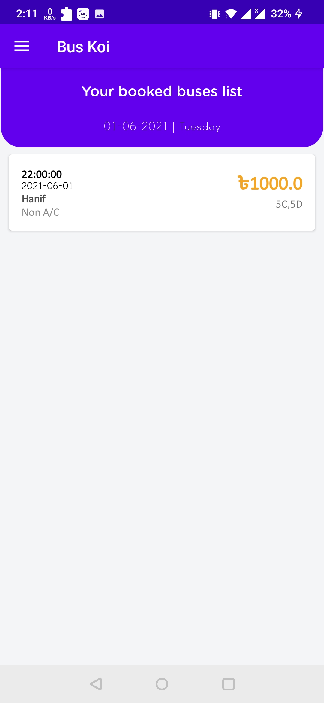
      <figcaption> 1 </figcaption>
    </figure>

    <figure style="display: inline-block;">
      
      <figcaption> 2 </figcaption>
    </figure>

   

#### 4. Ticket History
  

    <figure style="display: inline-block;">
      
      <figcaption> 1 </figcaption>
    </figure>

   

#### 5. Sign In and Sign Up
  

    <figure style="display: inline-block;">
      
      <figcaption> SignIn </figcaption>
    </figure>

    <figure style="display: inline-block;">
      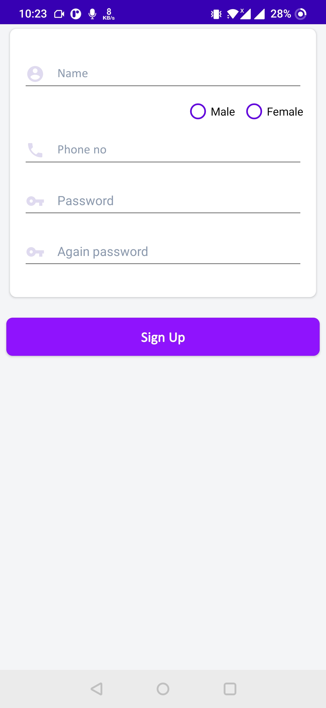
      <figcaption> SignUp </figcaption>
    </figure>

   

## **Screenshots of <u style="color:#4051B5;">_BusKoi Driver_</u> App (Driver)**

#### 1. Navigation Drawer
  <figure>
    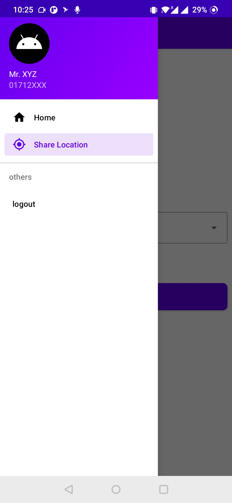
    <figcaption> </figcaption>
  </figure>

#### 2. Share Location
  

    <figure style="display: inline-block;">
      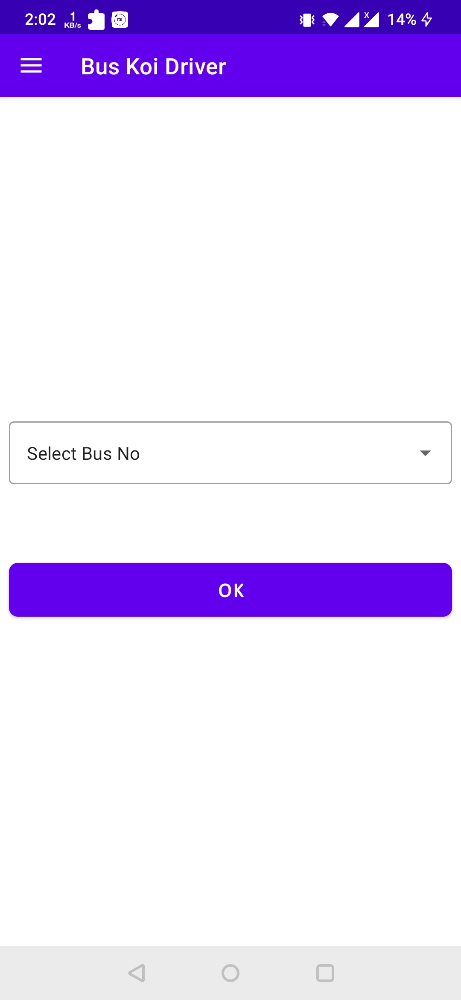
      <figcaption> 1</figcaption>
    </figure>

    <figure style="display: inline-block;">
      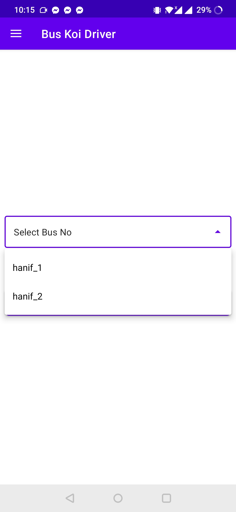
      <figcaption> 2 </figcaption>
    </figure>

    <figure style="display: inline-block;">
      
      <figcaption> 3 </figcaption>
    </figure>
    
    <figure style="display: inline-block;">
      
      <figcaption> 4 </figcaption>
    </figure>

   

#### 3. Sign In
  <figure>
    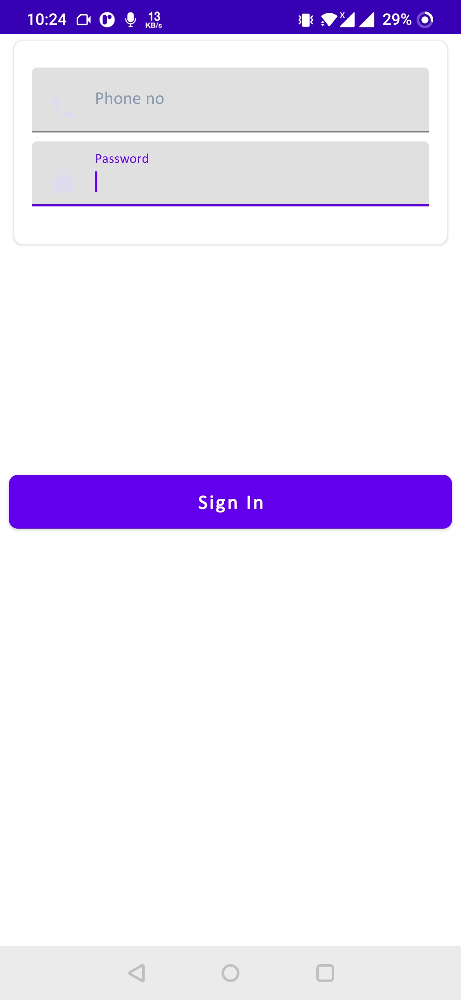
    <figcaption> </figcaption>
  </figure>

